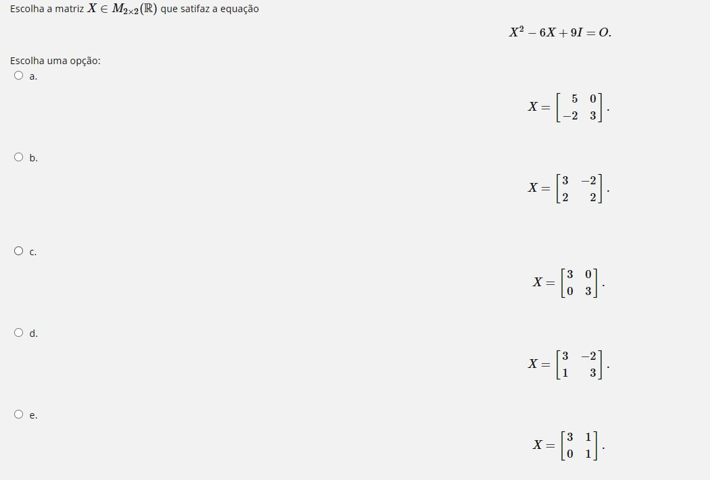

** Como podemos resolver a seguinte questão?

Bem, precisamos inicialmente entender o que a questão pede. 
Precisamos encontrar uma matriz X que satisfaça a equação *de matrizes* dada.
Digamos que $X$ seja:

$$\begin{bmatrix} a & b \\ c & d \end{bmatrix}$$

Primeiro, vamos calcular $X^2$. 
Aplicando as regras de multiplicação de matrizes, obteremos:

$$\begin{bmatrix}   a^2+bc & ab+bd \\ ca+cd & cb+d^2 \end{bmatrix}$$

Em seguida, aplicaremos as outras operações da equação.

$$6X = \begin{bmatrix} 6a & 6b \\ 6c & 6d \end{bmatrix}$$

$$9I = \begin{bmatrix} 9 & 0 \\ 0 & 9 \end{bmatrix}$$

(Note que esta operação não extrapola o universo de matrizes, ou seja, todas as somas, multiplicações ou produto por escalar resultam ainda em uma matriz, cujas entradas têm incógnitas)

Logo, 
$$ X^2 - 6X + 9I=0 \Longrightarrow $$

$$ \begin{bmatrix} a^2+bc-6a & ab+bd-6b \\ ca+cd-6c & d^2+cd-6d\end{bmatrix}+
\begin{bmatrix}
9 & 0 \\
0 & 9
\end{bmatrix}=
\begin{bmatrix}
0 & 0 \\ 0 & 0
\end{bmatrix} $$

Ficamos, então, com um sistema linear nas variáveis a, b, c e d:
$$ S=
\begin{cases}
a^2+bc-6a+9=0 \\
ab+bd-6b=0 \\
ca+cd-6c=0\\
d^2+cb-6d+9=0
\end{cases}
$$

Note que as linhas 2 e 3 do sistema $S$ são fatoráveis:
$$
b(a+d-6)=0 \Longrightarrow b=0\; \text{ou}\; a+d=6 \\
c(a+d-6)=0 \Longrightarrow c=0\; \text{ou}\; a+d=6
$$

cansei depois termino
